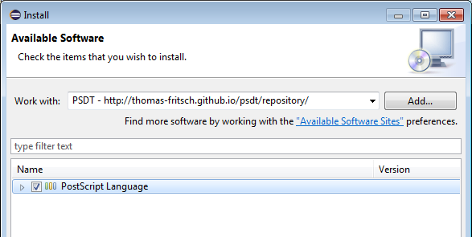

# PostScript Development Tools

This project delivers a [PostScript](https://en.wikipedia.org/wiki/PostScript) Integrated Development Environment for
[Eclipse](http://www.eclipse.org/). It cooperates with the [Ghostscript](https://ghostscript.com) interpreter in a
platform-independent way.

## Features

* Editor
	* Syntax Highlighting
	* Syntax Validation
	* Content Assist
	* Templates for well-known idioms (for, ifelse, image, repeat, stopped, ...)
	* Documentation Hovers
	* Documentation Hyperlinks
	* Toggle Comments
	* Outline/Structure View
	* Folding
	* Formatting
* Run/Debug
	* Launch with Ghostscript
	* Step in/over/out
	* Show Interpreter Stacks, Graphics State
	* Toggle/Enable/Disable Breakpoints
	* Run to Line
	* Watch Points
* Documentation
	* [PLRM](https://www.adobe.com/products/postscript/pdfs/PLRM.pdf)
	  sections in Help Contents (all Level 1, 2 operators)

## Installation

#### Prerequisites

* [Java](https://www.java.com/) (version 8 or higher).
* [Eclipse](http://www.eclipse.org) (version 4.6 or higher).
* [Ghostscript](http://ghostscript.com/download/gsdnld.html) (any version).  
  Choose the flavor for your OS and follow the download/install instructions.

#### Installation from Marketplace

* Drag this 
  button to your running Eclipse instance
* Follow the instructions in the usual manner

#### Installation from Update Site

* In Eclipse open menu _Help_ -> _Install New Software..._
* Use the _Add..._ button to add a new repository with  
  _Name:_ `PSDT`  
  _Location:_ `http://thomas-fritsch.github.io/psdt/repository/` 
* Wait for the software list to be displayed, select _PostScript Language_
  
* Follow the instructions in the usual manner

## Development setup

#### Prerequisites

* [JDK](http://www.oracle.com/technetwork/java/javase/downloads/) (version 8 or higher).
* [Maven](http://maven.apache.org/) (version 3).  
  Follow the instructions given in "Download, Install, Run Maven".

#### Build

A complete build (including unit tests) is done by:

    mvn clean verify

The generated update site will be in directory `de.tfritsch.psdt.updatesite/target/repository`.

#### IDE

The easiest way is to download and install the [Eclipse IDE for Java and DSL Developers](http://www.eclipse.org/downloads/packages/eclipse-ide-java-and-dsl-developers/neon1a).

Alternatively you can take an existing Eclipse instance and add the following components:

* [Eclipse Xtext](http://marketplace.eclipse.org/content/eclipse-xtext)
  
* [Eclipse Xtend](http://marketplace.eclipse.org/content/eclipse-xtend)
  
* [EGit - Git Integration for Eclipse](http://marketplace.eclipse.org/content/egit-git-integration-eclipse)
  
* [Maven Integration for Eclipse (Luna)](http://marketplace.eclipse.org/content/maven-integration-eclipse-luna)
  [")](http://marketplace.eclipse.org/marketplace-client-intro?mpc_install=1774116)

## Release History

* [1.1.0](https://github.com/thomas-fritsch/psdt/releases/tag/1.1.0) - 02 Dec 2018
* [1.0.5](https://github.com/thomas-fritsch/psdt/releases/tag/1.0.5) - 03 Sep 2017
* [1.0.4](https://github.com/thomas-fritsch/psdt/releases/tag/1.0.4) - 24 Mar 2017
* [1.0.3](https://github.com/thomas-fritsch/psdt/releases/tag/1.0.3) - 21 Jan 2017
* [1.0.2](https://github.com/thomas-fritsch/psdt/releases/tag/1.0.2) - 13 Dec 2016
* [1.0.1](https://github.com/thomas-fritsch/psdt/releases/tag/1.0.1) - 24 Nov 2016
* [1.0.0](https://github.com/thomas-fritsch/psdt/releases/tag/1.0.0) - 30 Oct 2016
