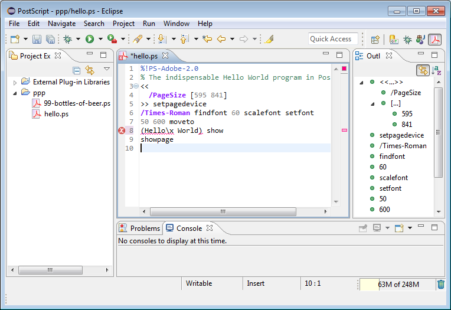
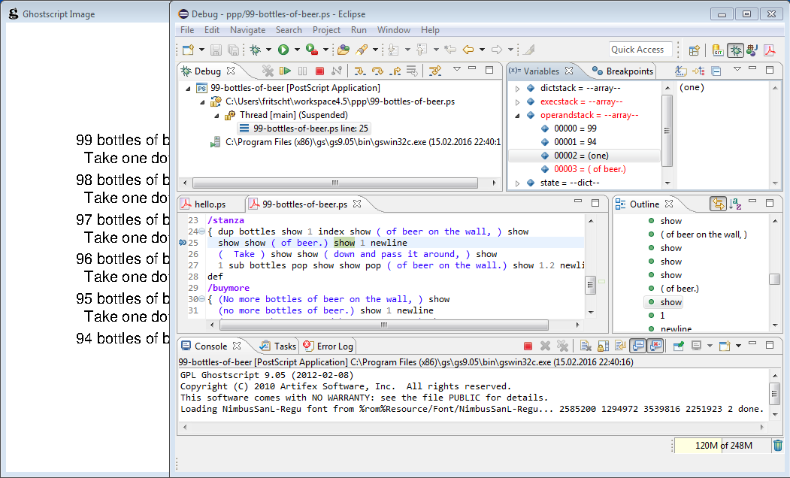

# PostScript Development Tools

### What is PSDT?
It is a [PostScript](https://en.wikipedia.org/wiki/PostScript) IDE for Eclipse,
including [editor](#user-content-editor), [debugger](#user-content-debugger)
and [documentation](#user-content-documentation).

### Editor
The PostScript editor (implemented using [Xtext](http://www.eclipse.org/Xtext/)) has most
features as expected from a state-of-the-art editor, like syntax coloring, outline view,
code folding, content assist, auto-edit for brackets, marked syntax errors.

### Debugger
Before using the PostScript debugger, you need to tell Eclipse about where [Ghostscript]
(http://www.ghostscript.com) is installed on your machine.

The debugger (implemented using Nigel Hathaway's [PostScript debugger]
(de.tfritsch.psdt.debug/psdebug.ps)) lets you step through your PostScript application,
set breakpoints, inspect the stacks, and watch the rendered page image.

### Documentation
Large parts of Adobe's [PostScript Language Reference Manual]
(https://www.adobe.com/products/postscript/pdfs/PLRM.pdf)
are integrated into the Eclipse help contents.

When you move the mouse over an identifier in the PostScript editor,
a hover with the corresponding documentation section is shown.

### Build
You need Java 6 (or higher) and [Maven 3](http://maven.apache.org/) to
build. The recommended build command is:

	mvn clean install

Then check the `de.tfritsch.psdt.updatesite/target/repository` directory to find the generated update site.
      
### Acknowledgements
- [The Launching Framework in Eclipse](https://eclipse.org/articles/Article-Launch-Framework/launch.html) by  Joe Szurszewski
- [How to write an Eclipse debugger](https://eclipse.org/articles/Article-Debugger/how-to.html) by Darin Wright and Bjorn Freeman-Benson
- [PS IDE/debugger](http://sourceforge.net/projects/wxghostscript/) by Nigel A. Hathaway
- [An Xtext language built with Maven](https://github.com/xtext/maven-xtext-example) by Sven Efftinge, Dennis Huebner and others
- [Eclipse User Help in your Xtext Hover](http://muelder.blogspot.de/2012/04/eclipse-user-help-in-your-xtext-hover.html) by Andreas Mülder
